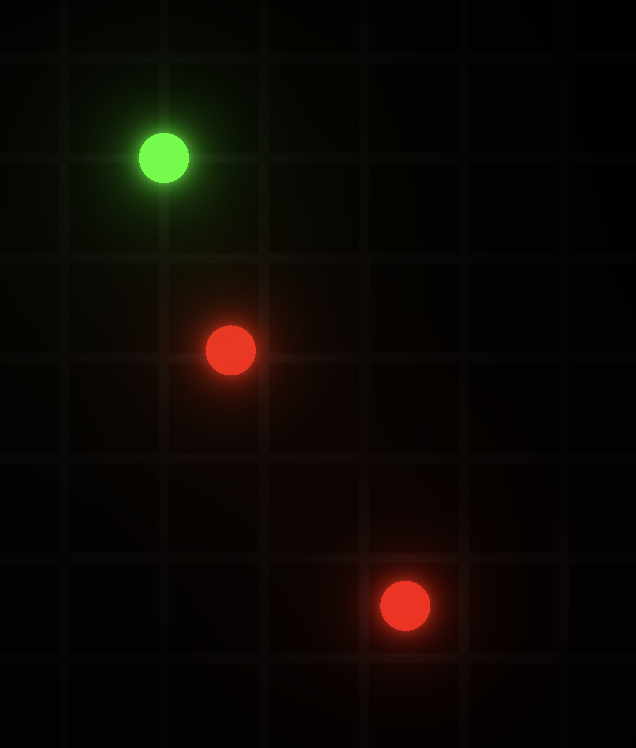

# Shadow Game

A game I am using to learn how to do shaders. In the game, you will move lights
around to match the reference image.

## Todo

- [ ] Add a way to win
- [ ] Setup a level with one light
- [ ] Setup a level with 2-3 lights
- [ ] Setup a way to navigate levels

## References

The game was inspired by [this video](video) and it's associated [code](code)

[video]: https://www.youtube.com/watch?v=bMTeCqNkId8&t=47s
[code]: https://editor.p5js.org/BarneyCodes/sketches/brfZ0NNpZ
